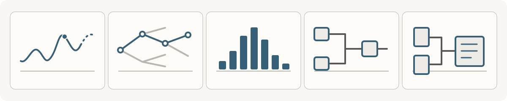

<picture>
  <source media="(prefers-color-scheme: dark)" srcset="assets/header-obscur.svg">
  <source media="(prefers-color-scheme: light)" srcset="assets/header-clair.svg">
  
</picture>

# Trinidy Farris

**I build things because I want to understand how they work and how far I can take them.**

I am an Air Force veteran studying computer science with an AI/ML concentration.
I expect to finish classes in January or February 2027 and graduate in April 2027.
My projects connect my logistics background with the systems, mathematics, and
creative work that keep me curious.

These are passion projects. I spend weeks at a time on them, sometimes months,
and I take pride in that. I like getting something working, finding the detail
I missed, and figuring out why it matters. I learn by building, and I want
people to be able to see the work behind the result.

I am looking for early career software engineering opportunities, with a growing
interest in MLOps and operational systems. My [LinkedIn profile](https://www.linkedin.com/in/t92t1914/)
has my experience and education.

[Forecasting](#freight-forecast) · [Stochastic search](#mcts-combat-engine) ·
[Probability](#exact-blackjack-solver) · [Adaptive timing](#adaptive-timing-engine) ·
[Tornado history](#tornado-atlas) ·
[Current focus](#systems-engineering)

## Start with a question

You can explore these saved examples in your browser before setting anything up.
They show recorded results with their assumptions and source revisions. The
project sections below also link to the code and local reproduction steps.

| If you want to see how I approach... | Start here |
| --- | --- |
| Forecast evaluation and serving | [Freight Forecast: one forecast and its baseline](https://t92t1914.github.io/freight-forecast/) |
| Concurrency and timing tradeoffs | [Adaptive Timing Engine: paired experiment results](https://t92t1914.github.io/adaptive-timing-engine/) |
| Decisions under uncertainty | [MCTS Combat Engine: one search decision](https://t92t1914.github.io/mcts-combat-engine/) |
| Numerical models and their limits | [Exact Blackjack Solver: a worked decision](https://t92t1914.github.io/exact-blackjack-solver/) |
| Historical data and interactive visualization | [Tornado Atlas: explore the recorded paths](https://t92t1914.github.io/tornado-atlas/atlas.html) |

## Systems engineering

A lot of my time goes into **timing and scheduling**. I like the details
that only show up once something is running: a plan that changes halfway
through a calculation, work that arrives too late, or a result that looks
right until I compare it with the trace. That has led me into concurrency,
simulation and better ways to check what the system actually did.

The application and original calibration data stay private. **Adaptive Timing
Engine** is a public companion that lets me share one part of the engineering:
a generalized concurrency design, a new timing simulation, generated workloads,
and their own tests. The five projects below are public and runnable.

I also built [Heterogeneous Batch Runtime](https://github.com/T92T1914/heterogeneous-batch-runtime),
a C++20 runtime with scalar, optimized CPU and optional CUDA paths. Its separate
[image classifier](https://github.com/T92T1914/heterogeneous-batch-runtime/tree/main/examples/image_classifier)
uses an ONNX Runtime session through C++ and the existing Timing resource owner.
Requests keep their own input and output, and obsolete results remain separate
from physically completed work. The core package does not need the inference
dependencies.

The [CPU inference comparison](https://github.com/T92T1914/heterogeneous-batch-runtime/blob/main/docs/inference-results.md)
checks complete output tensors and retains session setup, reuse and memory
observations. Reusing the C++ session was faster than creating it again, but the
direct Python baseline was faster for every tested batch size. CUDA inference
acceptance remains open. These results do not measure recognition accuracy.

## Five projects to explore

### Freight Forecast

**A problem I knew from logistics, built into a service you can inspect.**

Seasonal demand is familiar territory from my time in logistics. For this
project, I wanted to see whether a model could improve on using the same month
last year, then build the service around it and show how it behaves.

The project covers chronological evaluation, a FastAPI service, Docker,
Kubernetes, and Prometheus/Grafana monitoring. On **seeded synthetic data**, the
model's mean absolute error is **226 moves versus 327** for the seasonal baseline
across 24 months held out from training. Those numbers describe this
reproducible experiment. They are not a claim about operational shipment data.

<a href="https://github.com/T92T1914/freight-forecast/blob/main/docs/visual-example.md">
  <picture>
    <source media="(min-width: 1024px) and (prefers-color-scheme: dark)" srcset="https://raw.githubusercontent.com/T92T1914/freight-forecast/main/docs/freight-forecast-obscur-wide.png">
    <source media="(min-width: 1024px) and (prefers-color-scheme: light)" srcset="https://raw.githubusercontent.com/T92T1914/freight-forecast/main/docs/freight-forecast-clair-wide.png">
    <source media="(prefers-color-scheme: dark)" srcset="https://raw.githubusercontent.com/T92T1914/freight-forecast/main/docs/freight-forecast-obscur.png">
    <source media="(prefers-color-scheme: light)" srcset="https://raw.githubusercontent.com/T92T1914/freight-forecast/main/docs/freight-forecast-clair.png">
    
  </picture>
</a>

I also added a [monthly refitting experiment](https://github.com/T92T1914/freight-forecast/blob/main/docs/backtesting.md)
to check whether updating the model as new months arrive actually helps.
It beats the seasonal baseline overall, but loses to it in 2023 and does worse
than the original fixed model across the full test period. That was useful to
find out. The report keeps each prediction so the result can be checked.

I then tested the same model on the [BTS freight activity index](https://github.com/T92T1914/freight-forecast/blob/main/docs/real-data-evaluation.md),
a national, seasonally adjusted measure of for-hire freight activity rather than
shipment counts. I used 2010-2019 to choose the fitting policy and kept 2020-2025
for the final comparison. It beat the same-month-last-year baseline overall,
but lost to simply carrying forward the last observed value. These are revised
historical values, and the experiment does not replay publication delays. It
does not establish what I could have forecast with data available at the time.

A separate [interval study](https://t92t1914.github.io/freight-forecast/intervals.html)
adds ranges around the saved predictions without fitting the models again.
I compared fixed, rolling and adaptive residual ranges for all three predictors.
For the last observed value, rolling ranges covered 65 of 72 months and adaptive
ranges covered 66, compared with 62 for the fixed ranges. The extra coverage
required wider ranges, and the interval score did not improve. These are
retrospective results on an already examined period, not a guarantee for future
releases or every kind of freight demand.

The [prospective forecast ledger](https://t92t1914.github.io/freight-forecast/ledger.html)
now keeps issuance, source vintage, later observations and corrections as
separate records. It currently has zero real issuances. Its historical replay
and synthetic examples are labeled separately, so neither becomes a forecast
that was actually available before the outcome.

The [recorded Grafana dashboard](https://github.com/T92T1914/freight-forecast/blob/main/docs/grafana-dashboard.png)
shows the other side of this project: request rates, latency, rejected inputs,
and forecast distributions under local container traffic.

[Run a forecast](https://github.com/T92T1914/freight-forecast#quickstart) ·
[See the deployment evidence](https://github.com/T92T1914/freight-forecast/blob/main/VERIFICATION.md) ·
[Inspect a measured serving improvement](https://github.com/T92T1914/freight-forecast/blob/main/docs/serving-performance.md)

### MCTS Combat Engine

**What makes a good decision when the outcome can change?**

A turn based combat simulator gave me a place to explore that question. The
engine samples possible futures, compares decisions, and makes it possible to
see where a shallow search gets things wrong. It uses open loop Monte Carlo
Tree Search and optional parallel worker processes, in pure Python with no
runtime dependencies.

One detail I had to get right was what an action means as the state changes.
Removing a card shifts list indexes, but the action stored in the search tree
must still mean the same card. The implementation preserves that identity and
tests changing move availability. The benchmarks include the cases that
improved and the one that got worse.

I added a [more demanding comparison](https://github.com/T92T1914/mcts-combat-engine/blob/main/docs/comparison-results.md)
with a policy that samples every legal action one round ahead, including
healing and defense. I reused the same five environment seeds per scenario
across three search and policy seed settings. The one-round policy won every
duel condition. Search won more gauntlet
and boss games, but left one duel unfinished at the round limit. I kept the
individual results and work counts. The sample is small and the compute
budgets differ, so this does not establish a general ranking or efficiency gain.

I followed that with a [shared transition allowance](https://github.com/T92T1914/mcts-combat-engine/blob/main/docs/transition-comparison-results.md):
each search policy can advance the simulator at most 300 times per decision.
Under that protocol, MCTS won every duel and gauntlet condition and three or
four of five boss games per seed setting. The one-round policy won fewer duels
and gauntlets and no boss games. I kept unused allowances, stopping reasons
and unfinished games in the report. Equal simulator
allowances still do not mean equal processor time, and these five reused
environments per scenario are a limited comparison.

I also separated a [fixed work scaling study](https://t92t1914.github.io/mcts-combat-engine/parallel-scaling.html)
from a [same forest execution control](https://t92t1914.github.io/mcts-combat-engine/same-forest.html).
The control runs the same independently seeded trees sequentially and through
worker processes. All six comparisons matched their work counts, statistics
and ranked decisions. The parallel runs finished sooner in these observations,
but one warm run took longer than its cold counterpart. I kept startup costs
and that result visible. These single observations help isolate execution
from changing the search structure. They do not establish better play or a
general speedup.

<a href="https://github.com/T92T1914/mcts-combat-engine/blob/main/docs/visual-example.md">
  <picture>
    <source media="(min-width: 1024px) and (prefers-color-scheme: dark)" srcset="https://raw.githubusercontent.com/T92T1914/mcts-combat-engine/main/docs/mcts-decision-obscur-wide.png">
    <source media="(min-width: 1024px) and (prefers-color-scheme: light)" srcset="https://raw.githubusercontent.com/T92T1914/mcts-combat-engine/main/docs/mcts-decision-clair-wide.png">
    <source media="(prefers-color-scheme: dark)" srcset="https://raw.githubusercontent.com/T92T1914/mcts-combat-engine/main/docs/mcts-decision-obscur.png">
    <source media="(prefers-color-scheme: light)" srcset="https://raw.githubusercontent.com/T92T1914/mcts-combat-engine/main/docs/mcts-decision-clair.png">
    
  </picture>
</a>

[Read one decision](https://github.com/T92T1914/mcts-combat-engine#reading-one-decision) ·
[Explore the design decisions](https://github.com/T92T1914/mcts-combat-engine/blob/main/docs/design-decisions.md) ·
[Compare the results](https://github.com/T92T1914/mcts-combat-engine/blob/main/docs/benchmark-results.md)

### Exact Blackjack Solver

**The same total does not always mean the same decision.**

I wanted to follow that difference down to the cards left in the shoe. This
solver calculates action values using dynamic programming and memoization,
then checks the calculations with an independent simulation harness.

Hit, stand, and double are exactly enumerated within the supported model.
**Split valuation is approximate**, with independent split hands and an
approximation for the shared resplit budget. The CLI shows the values and the
margin between actions. If the difference is small, you can see that for yourself.

I built a separate [joint split reference](https://t92t1914.github.io/exact-blackjack-solver/joint-split.html)
to check what changes when two hands share the remaining cards and the same
dealer. Across 48 declared toy conditions, the largest difference was about
0.032 units of the original bet. One best action set expanded from double to
a double and split tie. That is useful evidence about these small cases, not
a bound for a full shoe. The report also keeps the invalid first attempt,
where a rank order mismatch made the two implementations compare different
shoes, and the mapping regression added before the corrected run.

I also checked [cache ownership and reuse](https://github.com/T92T1914/exact-blackjack-solver/blob/main/docs/cache-results-2026-09-30.md)
across 40 fresh interpreter sequences and 150 completed queries. Repeated inputs
kept the same values bit for bit, and combined clearing reset all nine production
tables. The report separates cache occupancy from process memory and keeps the
substantial allocation-tracing overhead. The arithmetic and split limits stay
unchanged.

<a href="https://github.com/T92T1914/exact-blackjack-solver/blob/main/docs/visual-example.md">
  <picture>
    <source media="(min-width: 1024px) and (prefers-color-scheme: dark)" srcset="https://raw.githubusercontent.com/T92T1914/exact-blackjack-solver/main/docs/blackjack-composition-obscur-wide.png">
    <source media="(min-width: 1024px) and (prefers-color-scheme: light)" srcset="https://raw.githubusercontent.com/T92T1914/exact-blackjack-solver/main/docs/blackjack-composition-clair-wide.png">
    <source media="(prefers-color-scheme: dark)" srcset="https://raw.githubusercontent.com/T92T1914/exact-blackjack-solver/main/docs/blackjack-composition-obscur.png">
    <source media="(prefers-color-scheme: light)" srcset="https://raw.githubusercontent.com/T92T1914/exact-blackjack-solver/main/docs/blackjack-composition-clair.png">
    
  </picture>
</a>

[Walk through a hand](https://github.com/T92T1914/exact-blackjack-solver#a-worked-decision) ·
[Explore the solver](https://github.com/T92T1914/exact-blackjack-solver#how-it-works) ·
[Read the model limits](https://github.com/T92T1914/exact-blackjack-solver#what-this-does-not-prove)

### Adaptive Timing Engine

**A way to see how timing policies behave under load.**

Timing variation interacts with workload, recovery, and the limits on what can
be executed. I built this standalone simulation to make those interactions
visible. The planning worker also handles a problem that matters whenever work
happens in the background: an old calculation finishing after a newer request
has made it obsolete.

The offline trace explorer compares **48 paired cases**, changing one policy
mechanism at a time. You can inspect the constraints, rejected work, and expired
deadlines. Under saturation at seed 42, the full policy admits **96 of 240**
tasks; disabling variation admits **108**. I kept that tradeoff visible. The
parameters are synthetic and do not establish a validated model of human behavior.

You can [open the trace explorer](https://t92t1914.github.io/adaptive-timing-engine/explorer.html)
without setup or download a self-contained HTML copy from the
[demo page](https://t92t1914.github.io/adaptive-timing-engine/). Auto, Clair and
Obscur preserve the selected workload, policy, seed, time window and trace export.
This presents the retained experiment without rerunning it. Its evaluated source
revision was not recorded, so the presentation keeps that gap explicit.

The [causal scheduler and its comparison](https://t92t1914.github.io/adaptive-timing-engine/causal.html)
take that work a step further. Announcements, updates and cancellations become
available only when delivered. An obsolete calculation cannot replace the
current plan, and dispatched work keeps its identity. Across 24 paired conditions,
the causal policy dispatched fewer tasks in 9, the same number in 7 and more in 8.
The policies differ in information and replanning behavior, so the report keeps
those outcomes separate from a claim that causality alone caused an improvement.

<a href="https://github.com/T92T1914/adaptive-timing-engine/blob/main/docs/visual-example.md">
  <picture>
    <source media="(min-width: 1024px) and (prefers-color-scheme: dark)" srcset="https://raw.githubusercontent.com/T92T1914/adaptive-timing-engine/main/docs/adaptive-timing-obscur-wide.png">
    <source media="(min-width: 1024px) and (prefers-color-scheme: light)" srcset="https://raw.githubusercontent.com/T92T1914/adaptive-timing-engine/main/docs/adaptive-timing-clair-wide.png">
    <source media="(prefers-color-scheme: dark)" srcset="https://raw.githubusercontent.com/T92T1914/adaptive-timing-engine/main/docs/adaptive-timing-obscur.png">
    <source media="(prefers-color-scheme: light)" srcset="https://raw.githubusercontent.com/T92T1914/adaptive-timing-engine/main/docs/adaptive-timing-clair.png">
    
  </picture>
</a>

[Run the trace explorer](https://github.com/T92T1914/adaptive-timing-engine#run-it) ·
[Inspect the concurrency decisions](https://github.com/T92T1914/adaptive-timing-engine/blob/main/docs/design-decisions.md) ·
[See the paired results](https://github.com/T92T1914/adaptive-timing-engine/blob/main/docs/evidence/results.md)

### Tornado Atlas

**A place to explore tornado history and the evidence behind it.**

I have always been interested in tornadoes. I wanted a way to study where they
went, what was documented, and what we can actually say about how they looked.
This project is becoming an interactive museum, starting with a searchable
atlas of NOAA records and a closer look at the 2013 El Reno tornado.

The atlas covers records from **1950 through 2025**. Some records describe county
segments of the same tornado, so I keep the record count separate from a count
of individual tornadoes. The El Reno exhibit links the track, documented damage
and source material. An interactive wind model and animated funnel study let
you explore the ideas visually, with their assumptions stated. They are
illustrations, not reconstructions of measured winds or a damage prediction.

The El Reno damage explorer lets you inspect survey points, filter their
recorded ratings, and follow each observation back to NWS. I keep the limits
visible when the source does not establish an event match, an impact time,
or the location of a photograph.

The shared timeline connects the path, available radar and selected warning
records, with timestamped links to original footage. A separate spatial replay
lets you explore the route in three dimensions and inspect recorded observer
positions and bearings on the same clock. The marker holds the latest recorded
position at or before the selected time and hides when that sample is more than
90 seconds old. That is a display rule, and the camera
samples stay separate from the footage. The freely orbiting camera and optional
funnel symbol are illustrative. Reconstructing the tornado's changing appearance
from registered views is still ahead.

The [evidence dossiers](https://t92t1914.github.io/tornado-atlas/dossier.html)
connect reviewed El Reno, Joplin and Blackwell material to exact source locators
and credited creators. A local research desk detects conflicting edits and
exports validated publication candidates without private notes. The
[Joplin school-refuge account](https://t92t1914.github.io/tornado-atlas/joplin.html#school-refuge)
follows NIST's observations while retaining the gaps about occupancy and use.
Source records remain separate from unique tornadoes, and linked media is not
automatically registered to an exact time or place.

[Explore the atlas](https://t92t1914.github.io/tornado-atlas/atlas.html) ·
[Visit the El Reno exhibit](https://t92t1914.github.io/tornado-atlas/) ·
[Inspect the damage map](https://t92t1914.github.io/tornado-atlas/survey.html) ·
[Explore the spatial replay](https://t92t1914.github.io/tornado-atlas/reconstruction.html) ·
[Read the source and verification notes](https://github.com/T92T1914/tornado-atlas)

## What connects the work

I like problems that keep giving me a reason to look closer. Sometimes it is
a timing detail. Sometimes it is a result I thought would improve and did not.
I keep examples, tests, measurements, and design notes close to the code
because I want to understand the decisions and be able to explain them.

I am working toward software engineering and MLOps roles in logistics, defense,
and operational technology. These projects also matter to me outside a job
search. I enjoy making them, and I want this page to show the range of what
I care about.

## How the projects connect to my work

My logistics background is the starting point for Freight Forecast. The other
projects let me work on the software problems around it: making a decision
under uncertainty, keeping background calculations current, checking numerical
results, and turning a large source collection into something people can use.

- **Backend and MLOps:** [Freight Forecast](https://t92t1914.github.io/freight-forecast/#engineering) connects evaluation, API boundaries and recorded service behavior.
- **Algorithms and numerical software:** [MCTS](https://t92t1914.github.io/mcts-combat-engine/#engineering) and the [probability solver](https://t92t1914.github.io/exact-blackjack-solver/#engineering) show assumptions, compute budgets and checks behind a result.
- **Concurrency and scheduling:** [Adaptive Timing Engine](https://t92t1914.github.io/adaptive-timing-engine/#engineering) makes obsolete work, resource limits and plan adoption inspectable.
- **Data engineering and interfaces:** [Tornado Atlas](https://t92t1914.github.io/tornado-atlas/survey.html) connects preserved source records with a map, photographs and explanations that stay usable when external media fails.

I am building evidence of those skills. The demos and simulations are not
claims that I have deployed them in a live logistics or emergency operation.
